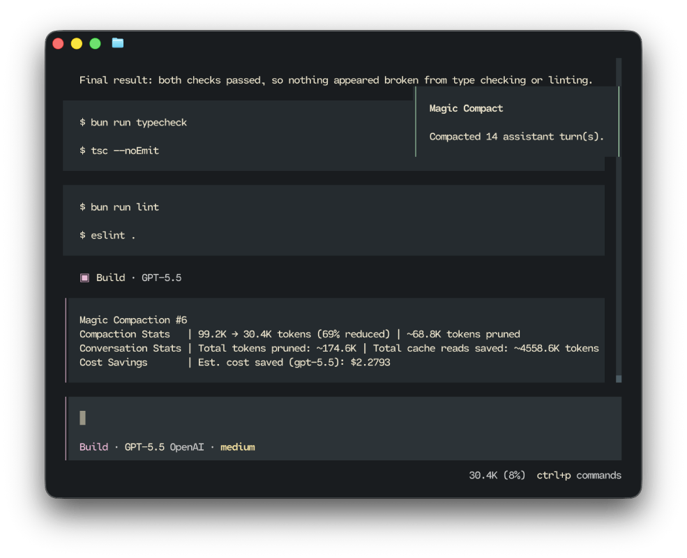
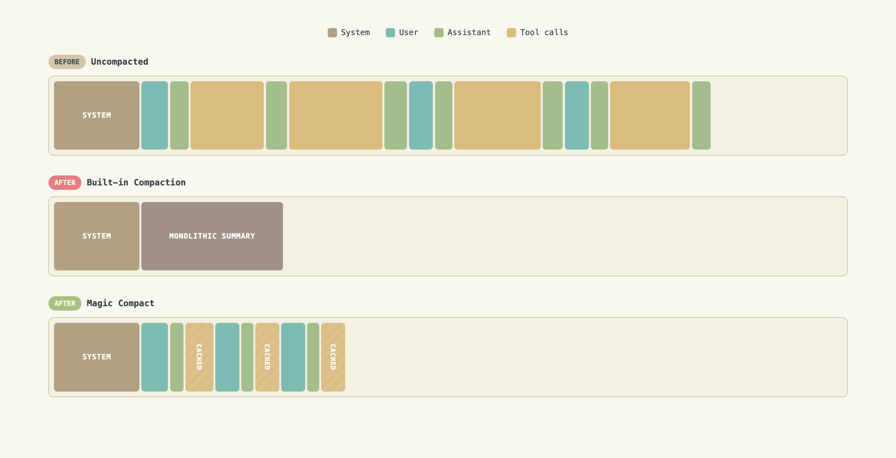

# Magic Compact

English | [中文](./README.zh-CN.md)

Lossless context compression for OpenCode and Claude Code.

<p align="center">
  
</p>

## Why

OpenCode and Claude Code's built-in compaction replaces an entire conversation with one summary blob. The user messages, the assistant's reasoning, tool calls, design decisions, and workflow are all flattened into a generic template (Goal, Progress, Key Decisions...). The agent wakes up with amnesia, forced to reconstruct its working state from an abstraction that captured a fraction of what mattered.

Magic Compact takes a different approach: preserve the conversation skeleton, condense each old assistant turn into its own summary, prune bulky tool I/O, and keep everything retrievable. The agent retains its memory of what it did, why, and what comes next.

## How

Instead of collapsing an entire session into a single generic summary, Magic Compact replaces old assistant turns with high-fidelity summaries while leaving user messages and tool calls in place.

The assistant's thought process, decisions, and actions remain in context along with all your commands while unnecessary bloat is stripped away. Long tool calls are aggressively pruned but can be retrieved via a custom `read_omitted_content` tool.

<p align="center">
  
</p>

## Features

- Lossless context compression — Fully preserve working memory instead of flattening history into one recap.
- Zero compaction overhead — Compaction happens once on your command rather than during the agentic loop. Maximum token savings, minimal cache invalidations.
- Preserved user messages — Exact requirements and guidance remain visible to the agent, verbatim.
- Smart tool call pruning — Bulky completed tool I/O is replaced with omission notices, with original content cached and retrievable on demand via `read_omitted_content`.
- Recompactable — Run `/magic-compact` again later to compact new turns while preserving prior summaries.

## Installation

Magic Compact works flawlessly on Claude Code, but OpenCode will have more features + first class support as OpenCode exposes more functionality to plugins.

### Claude Code

Install from this repository's first-party plugin marketplace:

```shell
/plugin marketplace add aerovato/magic-compact
/plugin install claude-magic-compact@magic-compact
```

After installation, run `/reload-plugins` if Claude Code is already open.

### OpenCode

Install from the CLI:

```bash
opencode plugin magic-compact --global

# If you are encountering "No versions available:
NPM_CONFIG_MIN_RELEASE_AGE=0 opencode plugin magic-compact --global
```

This installs the package and adds it to your global OpenCode config.

## Usage

### `/magic-compact`

To compact, run `/magic-compact [N]` with an optional argument indicating how many turns to preserve.

- `N` is the number of recent assistant turns to preserve as-is. Default: `0` (summarize everything).
- A backup session is created before the current conversation is compacted. If compaction fails, you will return to the backup.

Examples:

- `/magic-compact` — summarize all old assistant turns.
- `/magic-compact 3` — keep the 3 most recent assistant turns, summarize the rest.

### `/magic-stats` (OpenCode Exclusive)

Run `/magic-stats` to show cumulative token savings for the current conversation: tokens pruned, cached tokens saved, estimated money saved, among other statistics.

### The Omitted Content Tool

Magic Compact registers a `read_omitted_content` tool that the agent can call to retrieve any tool input or output that was pruned during compaction.

Each omission notice in the conversation includes a Content ID (e.g. `omitted-001`). The agent uses that ID to fetch the original content when it needs stale information that cannot be reproduced via a new tool call.

### Claude Code

Claude Code does not expose as much capability to plugins vs OpenCode. Therefore, certain differences are present when using Magic Compact for Claude Code:

- Magic Compact will create a compacted destintaion sesion instead of compacting in place.
  - Claude Code does not allow us to modify the current session's message transcript
- After compaction, Claude Code will tell you to run `/resume <new-session-id>` to enter the compacted session
  - Simply copy and paste that command and run it
- `/magic-stats` is not implemented for Claude Code

## Pruning Rules

Pruning applies only to summarized turns.

Kept:

- User messages (verbatim)
- Per-turn summaries
- Tool calls (structure preserved)
- Selected high-value synthetic messages (shell wrappers, background task results, working-directory change reminders)

Removed or condensed:

- Assistant reasoning, text, and step markers — replaced by the per-turn summary
- Most synthetic/injected messages (file expansions, plan reminders, prior compaction notices, etc.)
- Bulky completed tool I/O — replaced with an omission notice pointing to the cache

### Tool I/O Rules

Completed tool outputs over 128 words or 1024 characters are omitted by default. A few tools have special handling.

#### OpenCode

- `read` — output always omitted (stale file contents are reloadable)
- `write` / `edit` / `apply_patch` — large file content omitted
- `bash` — commands over 1024 characters are truncated
- `task` — output omitted above a higher threshold (512 words / 4096 characters)
- `question` — input and output preserved
- `todowrite` / `skill` — output discarded without caching (redundant or reloadable)

#### Claude Code

- `Read` / `NotebookEdit` — output always omitted (file text, notebook JSON, images, PDFs are reloadable)
- `Bash.command` — commands over 512 characters truncated; full command cached with an omission ID
- `Agent` / `TaskOutput` — output omitted above a higher threshold (512 words / 4096 characters)
- `AskUserQuestion` — input and output preserved (captures explicit user decisions)
- `Skill` — output discarded without caching (reloadable by re-invoking the skill)

Pending, running, and errored tool calls are always preserved as-is.

## Vs DCP Plugin (OpenCode)

OpenCode-DCP is a runtime context management system that rewrites messages when requested by the model. Magic Compact takes a different approach.

Magic Compact Offers:

- Simplicity — One command, zero configuration.
- Lossless quality — Turn-by-turn flow stays intact. All user commands are preserved. All past tool calls are preserved.
- Maximum token savings — The entire conversation is summarized with one request. Long tool calls are aggressively pruned.
- No cache churn — Compaction happens once and is cache friendly, whereas DCP may invalidate entire conversations multiple times within one request.
- Zero assistant overhead — No prompt injections asking the assistant to compact. Your assistant stay focused on its task.

If you want model-driven compaction with increased cache invalidations and token burn, consider using DCP instead.

## Vs Magic Context (OpenCode)

Magic Context is a much broader runtime context-management system: it runs background historian and dreamer processes, maintains project memory, and injects recalled memories and history back into the prompt on an ongoing basis. That makes it powerful, but also much heavier in tokens and cache churn.

Magic Compact Offers:

- Efficiency — One explicit compaction command, no background summarization loop, no always-on memory RAG, and no recurring prompt injections.
- Lower token burn — Context reduction happens once on demand instead of continuously consuming tokens across every turn.
- Fewer cache invalidations — The session is rewritten once, then stays stable, instead of repeatedly re-rendering volatile background state.
- Lossless conversation shape — User messages stay verbatim, tool structure is preserved, and summarized assistant turns remain retrievable.
- Focused compaction — The plugin does one job: compress the conversation without turning the runtime into a memory subsystem.

If you want a lightweight, user-driven compaction tool with minimal ongoing overhead, Magic Compact is the better fit. If you want a full long-term memory system with background maintenance, Magic Context is the heavier alternative.

## Development

See [`docs/Development.md`](./docs/Development.md) for setup and maintenance commands.
